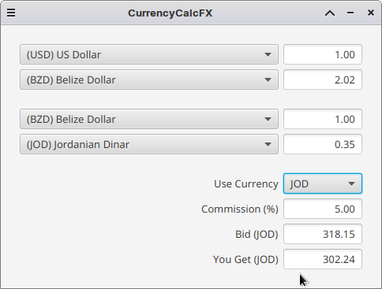

# CurrencyCalcFX

CurrencyCalcFX is designed to facilitate easy three-way currency conversion calculations, enabling users to specify the amount in one currency and instantly see the converted amounts in two other currencies, considering commission rates if applicable.

The application utilizes the JavaFX framework for the graphical user interface and Guice for dependency injection and has been created using a test-driven development (TDD) approach. It offers an intuitive user interface for inputting bid details and performing three-way currency conversions.

## Features

- Real-time three-way currency conversion with adjustable commission rates.
- User-friendly interface for entering bid details.
- Support for multiple currencies.
- Responsive GUI design using JavaFX.
- Modular architecture utilizing Guice for dependency injection.
